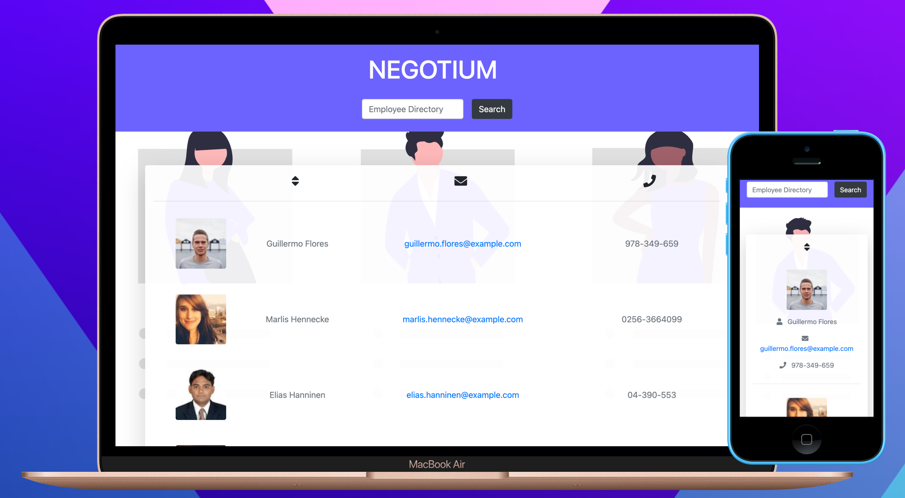

  # NEGOTIUM

  
  
  Employee directory built with React. Users generated from https://randomuser.me/. Supports sorting, filtering and search autocomplete using React's Context API    and lodash.

  An employee or manager would benefit greatly from being able to view non-sensitive data about other employees. It would be particularly helpful to be able to filter employees by name.
  
  Deployed site [available here](https://stephenlprice.github.io/negotium/).
   

  

  ### Etymology
  *nec* (“not”) +‎ *ōtium* (“leisure”)
  
  ### Noun
  **negōtium** n (*genitive negōtiī or negōtī*); second declension

  1. business, employment, occupation, affair
  2. (figuratively) difficulty, pains, trouble, labor 
  &nbsp;&nbsp;&nbsp;&nbsp;&nbsp;***Negotium** exhibere alicui.*  
  &nbsp;&nbsp;&nbsp;&nbsp;&nbsp;&nbsp;&nbsp;&nbsp;*To give **trouble** to someone.* 
  &nbsp;&nbsp;&nbsp;&nbsp;&nbsp;*Facili **negotio**.* 
  &nbsp;&nbsp;&nbsp;&nbsp;&nbsp;&nbsp;&nbsp;&nbsp;*With little **trouble**.* 
  3. (figuratively) matter, thing (= πρᾶγμα (prâgma)) 
  &nbsp;&nbsp;&nbsp;&nbsp;&nbsp;*Quid est **negotii**?* 
  &nbsp;&nbsp;&nbsp;&nbsp;&nbsp;&nbsp;&nbsp;&nbsp;*What **thing** is it?*
  

   

  ## Table of Contents
  1. [Installation](#Installation)
  2. [Usage](#Usage)
  3. [Contributing](#Contributing)
  4. [License](#License)
  5. [Questions](#Questions)
   
   

  ## Installation
  To install this project, please do the following: 
  Clone the repository and run it with `npm start`.

   

  ## Usage
  To get started, consider the following: 
  Visit the deployed site [here](https://stephenlprice.github.io/negotium/). The app will request a list of random employees from the [Random User Generator](https://randomuser.me). Users can then sort this list or search the employee directory with autocomplete functionality.

   

  ## Contributing

  ### Accepted Contributions:
  The following contributions are allowed for this project: 
  <ul>
    <li>creating issues</li><li>pull requests</li><li>suggesting enhancements</li><li>reporting bugs</li><li>documentation</li>
  </ul>
   

  ## License
  This project is licensed under the MIT license.
  For more information refer to this link: 
  

   

  ## Questions?
  To communicate with the project owner, use the following contact information: 
  Created by: stephenlprice  
  You can ask me any questions at this address: stellopricint@gmail.com
  
